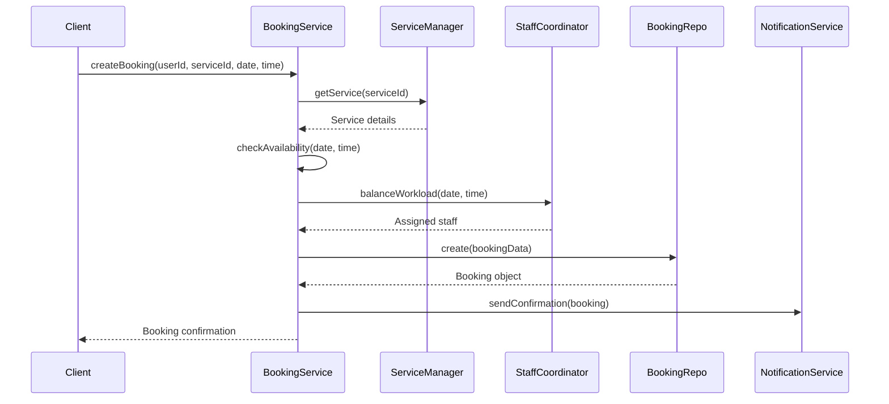

```mermaid
classDiagram
    direction TB

    %% ===== DOMAIN MODELS (ENTITIES) =====
    class User {
        +String id
        +String email
        +String name
        +String phone
        +UserRole role
        +Boolean isActive
        +Date lastLogin
        +hasPermission(action) bool
        +isClient() bool
        +isStaff() bool
        +isAdmin() bool
    }

    class Service {
        +String id
        +String name
        +String category
        +Decimal price
        +Integer durationMinutes
        +Integer displayOrder
        +Boolean isActive
        +String imageUrl
        +calculateEndTime(startTime) Time
        +isAvailableForBooking() bool
    }

    class Booking {
        +String id
        +Date bookingDate
        +Time startTime
        +Time endTime
        +BookingStatus status
        +String clientNotes
        +Decimal finalPrice
        +isUpcoming() bool
        +canCancel() bool
        +isPast() bool
        +getDuration() Integer
    }

    class StaffSchedule {
        +String id
        +Date scheduleDate
        +Time startTime
        +Time endTime
        +Boolean isAvailable
        +String notes
        +hasConflict(booking) bool
        +isWorkingAt(time) bool
    }

    class Product {
        +String id
        +String productName
        +String sku
        +Decimal price
        +Integer stockQuantity
        +Integer lowStockThreshold
        +Boolean isActive
        +needsReorder() bool
        +canSell(quantity) bool
    }

    class Offer {
        +String id
        +String title
        +String code
        +DiscountType discountType
        +Decimal discountValue
        +Date validFrom
        +Date validUntil
        +Integer usageLimit
        +Integer usageCount
        +isValid() bool
        +canRedeem() bool
        +calculateDiscount(price) Decimal
    }

    class Review {
        +String id
        +Integer rating
        +String reviewText
        +Boolean isFeatured
        +Date createdAt
        +isPositive() bool
    }

    %% ===== SERVICE LAYER (USE CASES) =====
    class BookingService {
        -BookingRepository bookingRepo
        -ServiceRepository serviceRepo
        -StaffCoordinator staffCoord
        -NotificationService notifier
        +checkAvailability(date, time, serviceId) AvailableSlots
        +createBooking(userId, serviceId, date, time) Booking
        +cancelBooking(bookingId, reason) Boolean
        +confirmBooking(bookingId) Boolean
        +completeBooking(bookingId) Boolean
        +getUpcomingBookings(userId) List~Booking~
        +getTodaysBookings(staffId) List~Booking~
    }

    class ServiceManager {
        -ServiceRepository serviceRepo
        -CategoryRepository categoryRepo
        +createService(details) Service
        +updateService(serviceId, updates) Service
        +deleteService(serviceId) Boolean
        +reorderServices(categoryId, order) Boolean
        +getServicesByCategory(category) List~Service~
        +getActiveServices() List~Service~
    }

    class StaffCoordinator {
        -UserRepository userRepo
        -ScheduleRepository scheduleRepo
        -BookingRepository bookingRepo
        +findAvailableStaff(date, time, duration) List~User~
        +assignStaffToBooking(bookingId, staffId) Boolean
        +updateSchedule(staffId, schedule) StaffSchedule
        +getStaffWorkload(staffId, date) Integer
        +balanceWorkload(date, time) User
    }

    class InventoryManager {
        -ProductRepository productRepo
        -NotificationService notifier
        +updateStock(productId, quantity) Product
        +checkLowStock() List~Product~
        +generateRestockAlert() Boolean
        +recordSale(productId, quantity) Boolean
        +getInventoryValue() Decimal
    }

    class OfferEngine {
        -OfferRepository offerRepo
        +validateOfferCode(code) Offer
        +applyDiscount(booking, offerCode) Decimal
        +getActiveOffers() List~Offer~
        +trackUsage(offerId) Boolean
        +checkUsageLimit(offerId) Boolean
    }

    class AuthService {
        -UserRepository userRepo
        -TokenService tokenService
        +login(email, password) AuthToken
        +logout(token) Boolean
        +validateSession(token) User
        +changePassword(userId, oldPass, newPass) Boolean
        +createUser(details) User
        +resetPassword(email) Boolean
    }

    class NotificationService {
        -SMSProvider smsProvider
        -EmailProvider emailProvider
        +sendBookingConfirmation(booking) Boolean
        +sendBookingReminder(bookingId) Boolean
        +sendCancellationNotice(booking) Boolean
        +alertLowStock(product) Boolean
        +notifyStaffAssignment(staffId, bookingId) Boolean
    }

    class AnalyticsEngine {
        -BookingRepository bookingRepo
        -ServiceRepository serviceRepo
        +getRevenueReport(startDate, endDate) Report
        +getPopularServices(limit) List~ServiceStats~
        +getStaffPerformance(staffId) PerformanceMetrics
        +getBookingTrends(period) TrendData
        +getClientRetention() RetentionMetrics
    }

    %% ===== RELATIONSHIPS =====
    
    %% Domain relationships
    User "1" -- "*" Booking : "makes (client)"
    User "1" -- "*" Booking : "serves (staff)"
    User "1" -- "*" StaffSchedule : "has"
    User "1" -- "*" Review : "writes"
    
    Service "1" -- "*" Booking : "booked_for"
    Service "1" -- "*" Review : "receives"
    
    Booking "*" -- "0..1" Offer : "applies"
    Booking "1" -- "0..1" Review : "generates"
    
    %% Service dependencies
    BookingService "1" -- "*" Booking : "manages"
    BookingService ..> StaffCoordinator : "uses"
    BookingService ..> NotificationService : "uses"
    
    ServiceManager "1" -- "*" Service : "organizes"
    
    StaffCoordinator "1" -- "*" StaffSchedule : "coordinates"
    StaffCoordinator ..> Booking : "assigns"
    
    InventoryManager "1" -- "*" Product : "tracks"
    InventoryManager ..> NotificationService : "uses"
    
    OfferEngine "1" -- "*" Offer : "validates"
    
    AnalyticsEngine ..> Booking : "analyzes"
    AnalyticsEngine ..> Service : "reports_on"
    AnalyticsEngine ..> User : "tracks"
```

# Class Diagram — Qesh

## **Overview**

This class diagram represents the core architectural layers of the **Qesh** platform, adhering to **Clean Architecture principles** to ensure clear separation of concerns. The design prioritizes:

- **Domain Models (Entities):** Pure business objects with no dependencies
- **Service Layer (Use Cases):** Business logic orchestration
- **Infrastructure Layer:** Database, APIs, external services

By maintaining this separation, Qesh achieves:
- **Testability:** Business logic can be unit tested without databases
- **Maintainability:** Changes to infrastructure don't ripple through business logic
- **Scalability:** New features extend the system without modifying core components

---



---

## **Class Descriptions**

### **Domain Models (Entities)**

| Class | Responsibility | Key Methods |
| --- | --- | --- |
| **User** | Represents all system users (clients, staff, admins) | `hasPermission()`: Check authorization<br>`isClient/isStaff/isAdmin()`: Role checking |
| **Service** | Salon service offerings with pricing and duration | `calculateEndTime()`: Compute booking end time<br>`isAvailableForBooking()`: Check if active |
| **Booking** | Core appointment entity | `canCancel()`: Business rule for cancellation window<br>`isUpcoming()`: Check if future appointment |
| **StaffSchedule** | Staff availability calendar | `hasConflict()`: Check time overlap<br>`isWorkingAt()`: Verify if staff available at specific time |
| **Product** | Inventory items (retail + supplies) | `needsReorder()`: Check stock threshold<br>`canSell()`: Validate sufficient stock |
| **Offer** | Promotional discount codes | `isValid()`: Check date range and usage<br>`calculateDiscount()`: Apply discount logic |
| **Review** | Customer feedback | `isPositive()`: Sentiment indicator (rating ≥ 4) |

---

### **Service Layer (Use Cases)**

| Class | Responsibility | Dependencies |
| --- | --- | --- |
| **BookingService** | Orchestrates the complete booking lifecycle | BookingRepository, ServiceRepository, StaffCoordinator, NotificationService |
| **ServiceManager** | Manages service catalog CRUD operations | ServiceRepository, CategoryRepository |
| **StaffCoordinator** | Handles staff assignment and scheduling | UserRepository, ScheduleRepository, BookingRepository |
| **InventoryManager** | Tracks product stock and generates alerts | ProductRepository, NotificationService |
| **OfferEngine** | Validates and applies promotional codes | OfferRepository |
| **AuthService** | Manages authentication and authorization | UserRepository, TokenService |
| **NotificationService** | Sends multi-channel notifications | SMSProvider, EmailProvider |
| **AnalyticsEngine** | Generates business intelligence reports | BookingRepository, ServiceRepository |

---

## **Key Design Patterns**

### **1. Repository Pattern**
Abstracts data access logic, allowing services to work with domain objects without SQL knowledge.

```typescript
interface BookingRepository {
  findById(id: string): Promise<Booking>;
  findByUserId(userId: string): Promise<Booking[]>;
  create(booking: Booking): Promise<Booking>;
  update(id: string, updates: Partial<Booking>): Promise<Booking>;
  delete(id: string): Promise<boolean>;
}
```

### **2. Service Layer Pattern**
Encapsulates business logic, keeping it separate from controllers and database code.

```typescript
class BookingService {
  async createBooking(
    userId: string,
    serviceId: string,
    date: Date,
    time: Time
  ): Promise<Booking> {
    // 1. Validate service exists and is active
    const service = await this.serviceRepo.findById(serviceId);
    if (!service || !service.isActive) throw new Error('Invalid service');

    // 2. Check availability
    const isAvailable = await this.checkAvailability(date, time, serviceId);
    if (!isAvailable) throw new Error('Slot unavailable');

    // 3. Find and assign staff
    const staff = await this.staffCoord.balanceWorkload(date, time);
    
    // 4. Create booking
    const booking = await this.bookingRepo.create({
      userId,
      serviceId,
      staffId: staff.id,
      bookingDate: date,
      startTime: time,
      endTime: service.calculateEndTime(time),
      status: 'PENDING'
    });

    // 5. Send notifications
    await this.notifier.sendBookingConfirmation(booking);

    return booking;
  }
}
```

### **3. Strategy Pattern (Offer Discounts)**
Different discount calculation strategies based on offer type.

```typescript
interface DiscountStrategy {
  calculate(price: Decimal): Decimal;
}

class PercentageDiscount implements DiscountStrategy {
  constructor(private percentage: number) {}
  calculate(price: Decimal): Decimal {
    return price * (this.percentage / 100);
  }
}

class FlatDiscount implements DiscountStrategy {
  constructor(private amount: Decimal) {}
  calculate(price: Decimal): Decimal {
    return Math.min(price, this.amount);
  }
}

// Usage in OfferEngine
applyDiscount(booking: Booking, offer: Offer): Decimal {
  const strategy = offer.discountType === 'PERCENTAGE'
    ? new PercentageDiscount(offer.discountValue)
    : new FlatDiscount(offer.discountValue);
  
  return strategy.calculate(booking.service.price);
}
```

### **4. Observer Pattern (Notifications)**
Booking events trigger notifications to relevant parties.

```typescript
class BookingService {
  private observers: NotificationObserver[] = [];

  subscribe(observer: NotificationObserver) {
    this.observers.push(observer);
  }

  private async notifyObservers(event: BookingEvent) {
    await Promise.all(
      this.observers.map(observer => observer.update(event))
    );
  }

  async confirmBooking(bookingId: string): Promise<Booking> {
    const booking = await this.bookingRepo.update(bookingId, {
      status: 'CONFIRMED'
    });

    // Notify all observers
    await this.notifyObservers({
      type: 'BOOKING_CONFIRMED',
      booking
    });

    return booking;
  }
}
```

---

## **Method Flow Examples**

### **Creating a Booking**



### **Staff Assignment Algorithm**

```typescript
// In StaffCoordinator class
async balanceWorkload(date: Date, time: Time): Promise<User> {
  // 1. Get all staff with schedules for this date
  const availableStaff = await this.findAvailableStaff(date, time);

  // 2. Count existing bookings per staff for this date
  const workloads = await Promise.all(
    availableStaff.map(async staff => ({
      staff,
      count: await this.getStaffWorkload(staff.id, date)
    }))
  );

  // 3. Sort by workload (least busy first)
  workloads.sort((a, b) => a.count - b.count);

  // 4. Return staff with least bookings
  return workloads[0].staff;
}
```

---

## **Dependency Injection**

All service classes receive their dependencies via constructor injection, enabling:
- **Testing:** Mock repositories in unit tests
- **Flexibility:** Swap implementations without changing code
- **Clarity:** Dependencies are explicit, not hidden

```typescript
class BookingService {
  constructor(
    private bookingRepo: BookingRepository,
    private serviceRepo: ServiceRepository,
    private staffCoord: StaffCoordinator,
    private notifier: NotificationService
  ) {}

  // Methods use injected dependencies
}

// Dependency injection container setup
const bookingService = new BookingService(
  new PrismaBookingRepository(),
  new PrismaServiceRepository(),
  new DefaultStaffCoordinator(),
  new TwilioNotificationService()
);
```

---

## **Error Handling**

Services throw domain-specific exceptions that controllers translate into HTTP responses.

```typescript
class BookingService {
  async createBooking(...): Promise<Booking> {
    const service = await this.serviceRepo.findById(serviceId);
    if (!service) {
      throw new ServiceNotFoundException(serviceId);
    }

    const isAvailable = await this.checkAvailability(...);
    if (!isAvailable) {
      throw new SlotUnavailableException(date, time);
    }

    // ... rest of booking logic
  }
}

// In Express controller
app.post('/api/bookings', async (req, res) => {
  try {
    const booking = await bookingService.createBooking(...);
    res.status(201).json(booking);
  } catch (error) {
    if (error instanceof ServiceNotFoundException) {
      res.status(404).json({ error: 'Service not found' });
    } else if (error instanceof SlotUnavailableException) {
      res.status(409).json({ error: 'Time slot unavailable' });
    } else {
      res.status(500).json({ error: 'Internal server error' });
    }
  }
});
```

---

## **Summary**

The Qesh class architecture demonstrates:
**Clean Architecture:** Clear separation between domain, business logic, and infrastructure  
**SOLID Principles:** Single responsibility, dependency inversion, interface segregation  
**Design Patterns:** Repository, Service Layer, Strategy, Observer  
**Testability:** All business logic can be unit tested without databases or external services  
**Maintainability:** Changes are localized, reducing ripple effects  
**Scalability:** New features extend existing patterns without modifications  

This architecture ensures Qesh remains **maintainable**, **testable**, and **scalable** as the platform grows.