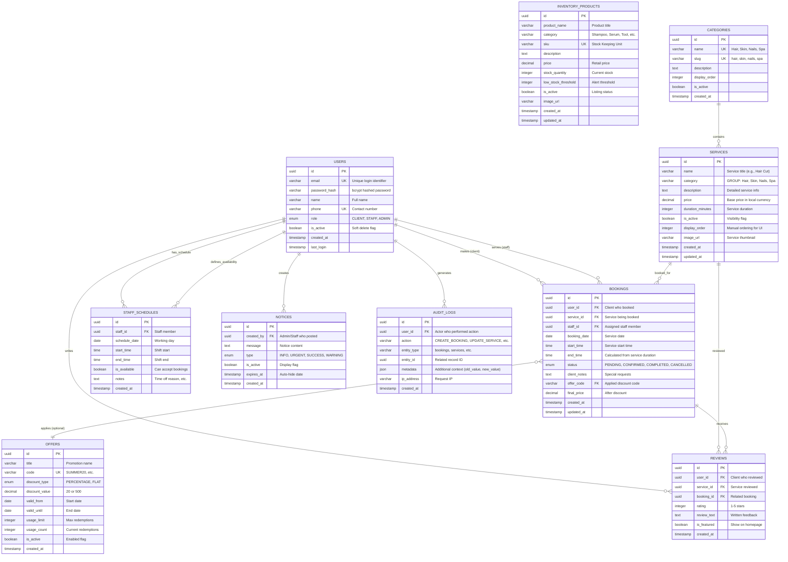

# Entity-Relationship Diagram — Qesh

### **1. Overview**

The Qesh database is the operational backbone of the entire salon management platform. Rather than just storing appointments in isolation, it orchestrates the complete customer journey—from service discovery to booking confirmation to post-visit feedback. 

By prioritizing **relational integrity** and **query performance**, the schema ensures that every booking is conflict-free, every staff assignment is valid, and every business transaction is traceable. The design supports the core business requirements:

- **Zero double-bookings** through unique constraints
- **Real-time availability** via indexed time-range queries  
- **Staff workload balance** through efficient aggregation queries
- **Audit compliance** with comprehensive activity logging
- **Business intelligence** through optimized reporting queries

---

### **2. ER Diagram**



---

### **3. Table Descriptions**

| Table | Purpose | Key Business Rules |
| --- | --- | --- |
| **USERS** | All system users including clients, staff, and administrators | • Email must be unique for login<br>• Phone used for SMS notifications<br>• `is_active=false` for soft deletion |
| **SERVICES** | Complete catalog of salon offerings | • Grouped by CATEGORIES for organization<br>• `display_order` controls UI sequence<br>• `is_active` controls visibility to clients |
| **BOOKINGS** | Core appointment records | • Cannot have overlapping time slots per staff<br>• `end_time` calculated from `start_time + service.duration`<br>• Status transitions: PENDING → CONFIRMED → COMPLETED |
| **STAFF_SCHEDULES** | Staff availability calendar | • Staff can only be assigned if schedule exists for that date<br>• `is_available=false` for time-off requests |
| **INVENTORY_PRODUCTS** | Retail and supply inventory | • `stock_quantity < low_stock_threshold` triggers alerts<br>• SKU must be unique for tracking |
| **OFFERS** | Promotional discount codes | • `usage_count` increments on each redemption<br>• Disabled when `usage_count >= usage_limit` |
| **REVIEWS** | Customer feedback system | • Must reference a completed booking<br>• `is_featured` curated by admin for homepage |
| **NOTICES** | Internal communication board | • Auto-hidden when `expires_at < NOW()`<br>• Type determines UI styling (icon, color) |
| **AUDIT_LOGS** | Security and compliance trail | • Immutable records (no updates/deletes)<br>• Captures all sensitive operations |
| **CATEGORIES** | Service grouping taxonomy | • Predefined set (Hair, Skin, Nails, Spa)<br>• `slug` used for URL-friendly routing |

---

### **4. Critical Indexes**

| Table | Index | Purpose | Query Pattern |
| --- | --- | --- | --- |
| `USERS` | `(email)` | Authentication lookups | `SELECT * FROM users WHERE email = ?` |
| `USERS` | `(role, is_active)` | Staff listing | `SELECT * FROM users WHERE role='STAFF' AND is_active=true` |
| `BOOKINGS` | `(staff_id, booking_date, start_time)` | Conflict detection | `WHERE staff_id=? AND booking_date=? AND start_time BETWEEN ? AND ?` |
| `BOOKINGS` | `(booking_date, status)` | Daily dashboard | `WHERE booking_date=TODAY() AND status='CONFIRMED'` |
| `BOOKINGS` | `(user_id, created_at DESC)` | Client history | `WHERE user_id=? ORDER BY created_at DESC LIMIT 10` |
| `STAFF_SCHEDULES` | `(staff_id, schedule_date)` | Availability checks | `WHERE staff_id=? AND schedule_date=?` |
| `SERVICES` | `(category, display_order)` | Catalog browsing | `WHERE is_active=true ORDER BY display_order` |
| `INVENTORY_PRODUCTS` | `(stock_quantity)` | Low-stock alerts | `WHERE stock_quantity < low_stock_threshold` |
| `OFFERS` | `(code, is_active)` | Code validation | `WHERE code=? AND is_active=true AND NOW() BETWEEN valid_from AND valid_until` |
| `AUDIT_LOGS` | `(entity_type, entity_id, created_at DESC)` | Activity history | `WHERE entity_type='bookings' AND entity_id=? ORDER BY created_at DESC` |

---

### **5. Relationship Details**

#### **User ↔ Bookings (Dual Role)**
```sql
-- A user can be a CLIENT making bookings
SELECT b.*, s.name as service_name 
FROM bookings b 
JOIN services s ON b.service_id = s.id
WHERE b.user_id = ? -- The client

-- A user can be a STAFF member assigned to bookings
SELECT b.*, u.name as client_name, s.name as service_name
FROM bookings b
JOIN users u ON b.user_id = u.id
JOIN services s ON b.service_id = s.id
WHERE b.staff_id = ? -- The staff member
```

#### **Service → Bookings (One-to-Many)**
Each service can have multiple bookings across different time slots and clients.

```sql
-- Popular services analysis
SELECT s.name, COUNT(b.id) as booking_count
FROM services s
LEFT JOIN bookings b ON s.id = b.service_id
WHERE b.status = 'COMPLETED'
GROUP BY s.id
ORDER BY booking_count DESC
LIMIT 10;
```

#### **Bookings → Offers (Optional Many-to-One)**
Bookings may optionally apply a discount code.

```sql
-- Revenue with discount analysis
SELECT 
  b.booking_date,
  SUM(s.price) as gross_revenue,
  SUM(b.final_price) as net_revenue,
  SUM(s.price - b.final_price) as total_discounts
FROM bookings b
JOIN services s ON b.service_id = s.id
WHERE b.status = 'COMPLETED'
GROUP BY b.booking_date;
```

#### **Staff ↔ Staff_Schedules (One-to-Many)**
Each staff member has multiple schedule entries defining their availability.

```sql
-- Staff availability for a specific date
SELECT 
  u.name,
  ss.start_time,
  ss.end_time,
  ss.is_available
FROM users u
JOIN staff_schedules ss ON u.id = ss.staff_id
WHERE u.role = 'STAFF' 
  AND ss.schedule_date = '2026-02-20'
  AND ss.is_available = true;
```

---

### **6. Business Constraints**

#### **Constraint 1: No Double-Booking**
```sql
-- Database-level unique constraint (partial)
CREATE UNIQUE INDEX idx_no_double_booking 
ON bookings (staff_id, booking_date, start_time)
WHERE status != 'CANCELLED';

-- Application-level check before booking
SELECT COUNT(*) FROM bookings
WHERE staff_id = ?
  AND booking_date = ?
  AND status != 'CANCELLED'
  AND (
    (start_time <= ? AND end_time > ?)  -- New booking starts during existing
    OR (start_time < ? AND end_time >= ?)  -- New booking ends during existing
    OR (start_time >= ? AND end_time <= ?)  -- New booking fully contained
  );
```

#### **Constraint 2: Staff Must Have Schedule**
```sql
-- Before assigning staff to booking
SELECT id FROM staff_schedules
WHERE staff_id = ?
  AND schedule_date = ?
  AND is_available = true
  AND start_time <= ?
  AND end_time >= ?;
-- Only assign if result exists
```

#### **Constraint 3: Offer Usage Limit**
```sql
-- Before applying offer code
SELECT usage_count, usage_limit 
FROM offers 
WHERE code = ? 
  AND is_active = true
  AND CURDATE() BETWEEN valid_from AND valid_until;

-- Reject if usage_count >= usage_limit
```

---

### **7. Data Integrity Features**

**Foreign Key Constraints** - Prevent orphaned records  
**Check Constraints** - Ensure valid enum values  
**Unique Constraints** - Prevent duplicate emails, SKUs, codes  
**NOT NULL Constraints** - Enforce required fields  
**Default Values** - Auto-populate timestamps, status  
**Cascading Deletes** - Handle related record cleanup  
**Soft Deletes** - Use `is_active=false` instead of DELETE  

---

### **8. Migration Strategy**

```bash
# Using Prisma migrations
npx prisma migrate dev --name init
npx prisma migrate dev --name add_categories_table
npx prisma migrate deploy  # Production
```

---

### **Summary**

The Qesh database schema is designed with **business logic baked in**. It's not just a data store—it's an active participant in ensuring operational integrity. Every table, index, and constraint serves a clear business purpose: preventing errors, enabling fast queries, and supporting intelligent features.