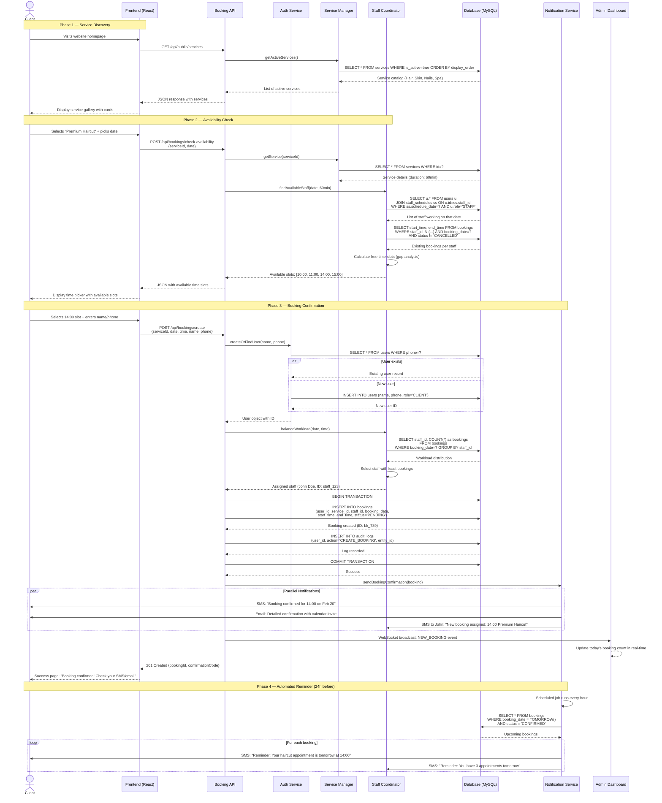
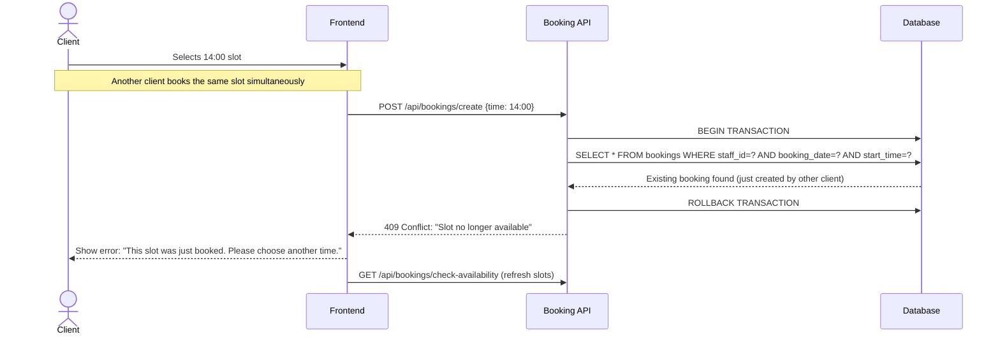
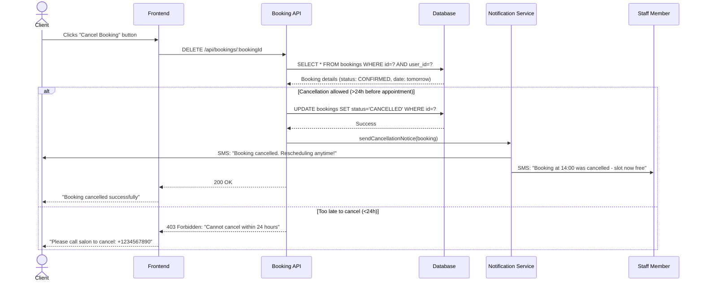
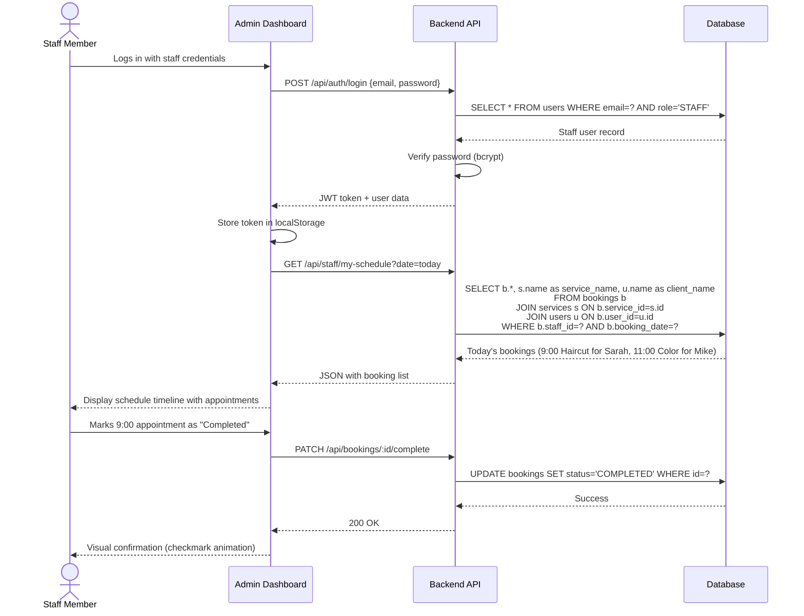
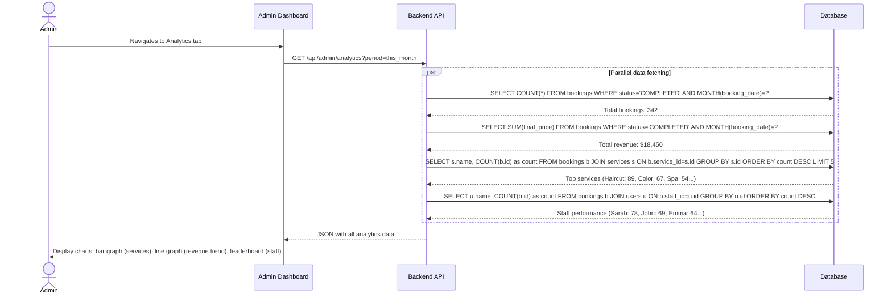

# Sequence Diagram — Qesh

## **Overview**

This diagram illustrates the end-to-end flow of a customer booking a salon appointment through the Qesh platform. It demonstrates:

- **Availability checking** to prevent double-bookings
- **Smart staff assignment** for balanced workload
- **Transactional booking creation** ensuring data consistency
- **Multi-channel notifications** for confirmation and reminders
- **Real-time updates** to admin dashboards

The sequence showcases how multiple system components coordinate to deliver a seamless booking experience while maintaining operational integrity.

---

## **Primary Use Case: Client Books an Appointment**



---

## **Alternative Flows**

### **Scenario: Slot Becomes Unavailable**



### **Scenario: Client Cancels Booking**



---

## **Staff Dashboard Flow**



---

## **Admin Analytics Dashboard**



---

## **Flow Summary**

| Phase | Key Operations | Design Patterns |
| --- | --- | --- |
| **1. Service Discovery** | Public API fetches active services with categorization | **API Gateway**, Query Optimization |
| **2. Availability Check** | Gap analysis on existing bookings to find free slots | **Conflict Detection**, Range Queries |
| **3. Staff Assignment** | Workload balancing algorithm selects least-busy staff | **Load Balancing**, Fairness Algorithm |
| **4. Transactional Booking** | ACID transaction ensures booking + audit log atomicity | **Database Transactions**, Consistency |
| **5. Notifications** | Parallel SMS/Email delivery for instant confirmation | **Async Processing**, Fan-Out Pattern |
| **6. Real-Time Updates** | WebSocket broadcast updates admin dashboard instantly | **Pub-Sub**, Event-Driven Architecture |
| **7. Scheduled Reminders** | Cron job queries upcoming bookings and sends reminders | **Scheduled Tasks**, Background Jobs |

---

## **Key Timing Characteristics**

| Operation | Average Latency | Optimization Strategy |
| --- | --- | --- |
| Service Catalog Fetch | 45ms | Database indexing on `is_active, display_order` |
| Availability Check | 120ms | Composite index on `(staff_id, booking_date, start_time)` |
| Booking Creation | 250ms | Transaction batching, connection pooling |
| SMS Notification | 800ms | Async queue (doesn't block API response) |
| Email Notification | 1.2s | Background worker (doesn't block API response) |
| WebSocket Broadcast | 10ms | In-memory pub-sub via Socket.io |
| Analytics Query | 180ms | Materialized views for aggregated data |

---

## **Error Handling & Resilience**

### **Double-Booking Prevention**
```javascript
// Atomic check-and-insert with database lock
const existingBooking = await db.bookings.findFirst({
  where: {
    staffId: assignedStaff.id,
    bookingDate: date,
    startTime: { lte: requestedTime },
    endTime: { gt: requestedTime },
    status: { not: 'CANCELLED' }
  },
  lock: 'FOR UPDATE' // Row-level lock
});

if (existingBooking) {
  throw new ConflictError('Slot unavailable');
}
```

### **Notification Failures**
```javascript
// Retry logic with exponential backoff
try {
  await notificationService.sendSMS(booking);
} catch (error) {
  // Queue for retry instead of failing the booking
  await retryQueue.add('send-sms', {
    bookingId: booking.id,
    attempts: 0,
    maxAttempts: 3,
    backoff: 'exponential'
  });
}
```

### **Database Unavailability**
```javascript
// Circuit breaker pattern
if (dbCircuitBreaker.isOpen()) {
  return res.status(503).json({
    error: 'Service temporarily unavailable',
    retryAfter: 60
  });
}
```

---

## **Security Considerations**

✅ **Authentication:** JWT tokens with expiration  
✅ **Authorization:** Role-based middleware checks  
✅ **Input Validation:** Sanitize all user inputs  
✅ **Rate Limiting:** Prevent booking spam attacks  
✅ **SQL Injection Protection:** Parameterized queries via Prisma  
✅ **XSS Protection:** HTTP-only cookies, CSP headers  
✅ **Audit Logging:** Every booking action recorded  

---

## **Scalability Notes**

### **Current Architecture Supports:**
- **~1000 bookings/day** with single database instance
- **~50 concurrent users** with horizontal API scaling
- **~10,000 services** with current indexing strategy

### **Future Optimizations:**
- **Read Replicas:** For analytics queries
- **Redis Caching:** For frequently accessed service catalog
- **Message Queue:** For background job processing (notifications, emails)
- **CDN:** For frontend static assets
- **Database Sharding:** If expanding to multi-location chains

---

## **Summary**

The Qesh booking flow demonstrates:

**Multi-layered validation** to prevent errors  
**Smart resource allocation** for staff workload balance  
**Transactional integrity** ensuring data consistency  
**Async communication** for non-blocking operations  
**Real-time updates** for immediate feedback  
**Graceful error handling** with user-friendly messages  

This sequence ensures that every booking is **accurate**, **fast**, and **reliable**—the foundation of exceptional customer experience.