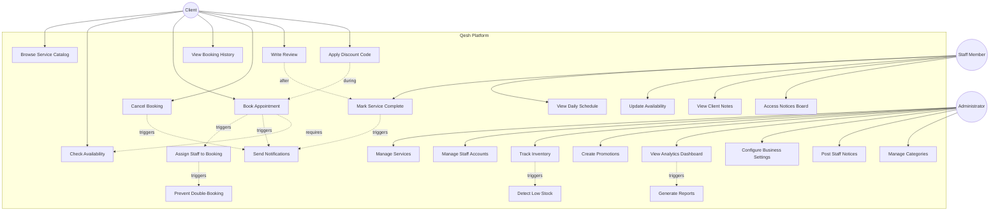

# Use Case Diagram — Qesh

## **Overview**

This diagram maps all major use cases for the Qesh platform, organized by the three primary actors:

- ** Clients:** End customers who book salon services
- ** Staff:** Service providers (stylists, therapists, technicians)
- ** Admins:** Salon owners and managers

The system focuses on three core pillars:
1. **Seamless Booking Experience** for clients
2. **Operational Efficiency** for staff
3. **Business Intelligence** for admins

---



---

## **Use Case Descriptions**

### **Client Use Cases**

| # | Use Case | Description | Pre-Conditions | Success Criteria |
| --- | --- | --- | --- | --- |
| UC1 | **Browse Service Catalog** | View all available salon services organized by category (Hair, Skin, Nails, Spa) with pricing and duration information. | None (public access) | Services display in categorized grid with images and details |
| UC2 | **Check Availability** | Query available time slots for a selected service on a specific date. | Service selected | System returns list of free time slots with staff availability |
| UC3 | **Book Appointment** | Reserve a specific service at a chosen date/time, providing contact information. | Availability verified | Booking created, confirmation sent via SMS/email |
| UC4 | **View Booking History** | Access past and upcoming appointments with status tracking. | User authenticated (or phone number verified) | Display chronological list of bookings with details |
| UC5 | **Cancel Booking** | Request cancellation of a confirmed appointment (subject to cancellation policy). | Booking exists, policy allows (e.g., >24h notice) | Booking status updated to CANCELLED, notifications sent |
| UC6 | **Write Review** | Submit rating (1-5 stars) and written feedback for a completed service. | Service marked as COMPLETED | Review saved, optionally featured on homepage |
| UC7 | **Apply Discount Code** | Enter promotional code during booking to receive discount. | Valid offer code exists, not expired, usage limit not reached | Discount applied to final price, offer usage count incremented |

---

### **Staff Use Cases**

| # | Use Case | Description | Pre-Conditions | Success Criteria |
| --- | --- | --- | --- | --- |
| UC8 | **View Daily Schedule** | Access personal dashboard showing assigned bookings for selected date. | Staff authenticated | Chronological list of appointments with client names, services, times |
| UC9 | **Mark Service Complete** | Update booking status when service is finished, triggering review request to client. | Booking assigned to logged-in staff | Status updated to COMPLETED, client notified to leave review |
| UC10 | **Update Availability** | Modify working hours, mark specific dates as unavailable (time off requests). | Staff authenticated | Schedule updated, system stops assigning bookings during unavailable periods |
| UC11 | **View Client Notes** | Read special instructions or preferences noted by client during booking. | Booking assigned to staff | Display client notes field within booking details |
| UC12 | **Access Notices Board** | Read internal announcements posted by admin (shift changes, policy updates). | Staff authenticated | Display list of active notices sorted by urgency/date |

---

### **Admin Use Cases**

| # | Use Case | Description | Pre-Conditions | Success Criteria |
| --- | --- | --- | --- | --- |
| UC13 | **Manage Services** | Create, update, delete, and reorder salon services in the catalog. | Admin authenticated | Services CRUD operations successful, changes reflect in public catalog |
| UC14 | **Manage Staff Accounts** | Add new staff members, update profiles, assign roles, deactivate accounts. | Admin authenticated | Staff accounts created/updated, login credentials generated |
| UC15 | **Track Inventory** | Monitor product stock levels, update quantities, set low-stock thresholds. | Admin authenticated | Inventory data accurate, alerts triggered when stock is low |
| UC16 | **Create Promotions** | Design discount codes with percentage/flat rates, validity periods, usage limits. | Admin authenticated | Offer created, code becomes redeemable during booking |
| UC17 | **View Analytics Dashboard** | Access business metrics: revenue, booking counts, popular services, staff performance. | Admin authenticated | Dashboard displays charts and KPIs with accurate data |
| UC18 | **Configure Business Settings** | Update salon name, contact info, working hours, cancellation policies. | Admin authenticated | Settings saved and applied system-wide |
| UC19 | **Post Staff Notices** | Publish internal announcements visible to all staff members on their dashboard. | Admin authenticated | Notice created, visible to all staff with appropriate urgency indicator |
| UC20 | **Manage Categories** | Create, update, or reorder service categories (e.g., "Hair Treatments" vs. "Hair Styling"). | Admin authenticated | Categories updated, services properly grouped in catalog |

---

### **System-Driven Use Cases (Automated)**

| # | Use Case | Description | Trigger | Success Criteria |
| --- | --- | --- | --- | --- |
| UC21 | **Assign Staff to Booking** | Automatically select available staff member with least workload for fairness. | UC3 (Book Appointment) | Staff with minimal bookings for that day assigned to new booking |
| UC22 | **Send Notifications** | Dispatch SMS/email confirmations, reminders, and alerts to clients and staff. | UC3, UC5, UC9 | Notifications delivered within 30 seconds of trigger event |
| UC23 | **Generate Reports** | Compile business intelligence data for analytics dashboard. | UC17 (View Analytics) | Accurate aggregation of bookings, revenue, and performance metrics |
| UC24 | **Detect Low Stock** | Monitor inventory levels and alert admin when products fall below threshold. | UC15 (Inventory update) | Alert displayed in admin dashboard and sent via email |
| UC25 | **Prevent Double-Booking** | Validate booking request against existing appointments to ensure no conflicts. | UC21 (Staff Assignment) | Only allow booking creation if time slot is truly available for assigned staff |

---

## **User Stories**

### **Client Stories**

```gherkin
Feature: Book Salon Appointment

Scenario: Client books a haircut successfully
  Given the client is on the Qesh homepage
  When they browse the "Hair" category
  And click on "Premium Haircut - $45"
  And select "February 20, 2026"
  And choose the "14:00" time slot
  And enter their name and phone number
  Then the system creates a confirmed booking
  And sends SMS confirmation with appointment details
  And displays a success message with booking ID

Scenario: Client tries to book an unavailable slot
  Given another client just booked the 14:00 slot
  When the first client attempts to book the same slot
  Then the system shows "Slot no longer available"
  And suggests alternative time slots
```

### **Staff Stories**

```gherkin
Feature: Staff Daily Schedule

Scenario: Staff member views today's appointments
  Given a staff member logs into the Qesh dashboard
  When they navigate to "My Schedule"
  Then they see all appointments assigned to them today
  And each appointment shows:
    | Field | Example |
    | Time | 10:00 AM - 11:00 AM |
    | Service | Premium Haircut |
    | Client | Sarah Johnson |
    | Notes | "Please trim split ends" |

Scenario: Staff marks service as complete
  Given a staff member finished a 10:00 AM haircut
  When they click "Mark Complete" on the appointment
  Then the status updates to "Completed"
  And the client receives an SMS asking for a review
  And the appointment shows a green checkmark in the schedule
```

### **Admin Stories**

```gherkin
Feature: Business Analytics

Scenario: Admin views monthly revenue report
  Given an admin logs into the dashboard
  When they navigate to "Analytics" and select "This Month"
  Then they see:
    | Metric | Value |
    | Total Bookings | 342 |
    | Total Revenue | $18,450 |
    | Average Booking Value | $53.95 |
    | Most Popular Service | Premium Haircut (89 bookings) |
  And a line chart showing daily revenue trends
  And a bar chart showing service category breakdown
```

---

## **Actor Permissions Matrix**

| Use Case | Client | Staff | Admin |
| --- | :---: | :---: | :---: |
| Browse Service Catalog | ✅ | ✅ | ✅ |
| Check Availability |  |  |  |
| Book Appointment | ✅ | ✅ | ✅ |
| View Own Bookings | ✅ | - | ✅ |
| Cancel Own Booking | ✅ | - | ✅ |
| Write Review | ✅ | - | - |
| Apply Discount Code | ✅ | ✅ | ✅ |
| View Daily Schedule | - | ✅ | ✅ |
| Mark Service Complete | - | ✅ | ✅ |
| Update Own Availability | - | ✅ | - |
| View Client Notes | - | ✅ | ✅ |
| Access Notices Board | - | ✅ | ✅ |
| Manage Services | - | - | ✅ |
| Manage Staff Accounts | - | - | ✅ |
| Track Inventory | - | - | ✅ |
| Create Promotions | - | - | ✅ |
| View Analytics | - | - | ✅ |
| Configure Settings | - | - | ✅ |
| Post Notices | - | - | ✅ |

---

## **Use Case Priorities**

### **P0 (Launch Blockers)**
- UC1: Browse Service Catalog
- UC2: Check Availability
- UC3: Book Appointment
- UC8: View Daily Schedule
- UC9: Mark Service Complete
- UC13: Manage Services
- UC14: Manage Staff Accounts
- UC21: Assign Staff to Booking
- UC22: Send Notifications
- UC25: Prevent Double-Booking

### **P1 (Post-Launch)**
- UC4: View Booking History
- UC5: Cancel Booking
- UC10: Update Availability
- UC15: Track Inventory
- UC16: Create Promotions
- UC17: View Analytics Dashboard
- UC24: Detect Low Stock

### **P2 (Future Enhancements)**
- UC6: Write Review
- UC7: Apply Discount Code
- UC11: View Client Notes
- UC12: Access Notices Board
- UC18: Configure Business Settings
- UC19: Post Staff Notices
- UC20: Manage Categories
- UC23: Generate Reports

---

## **Integration Points**

### **External Services**
- **Twilio API:** For SMS notifications (UC22)
- **SendGrid API:** For email notifications (UC22)
- **Google Maps API:** Embedded in contact page (not shown in diagram)
- **Payment Gateway:** Future integration for online payments

### **Internal Systems**
- **Database (MySQL):** Persistent storage for all use cases
- **Authentication Service:** JWT-based login for all actor types
- **Notification Queue:** Background workers for async messaging
- **Audit Logging:** Tracks all admin actions for compliance

---

## **Success Metrics**

| Use Case | Key Metric | Target |
| --- | --- | --- |
| UC3 (Book Appointment) | Completion rate | >85% |
| UC3 (Book Appointment) | Time to complete | <60 seconds |
| UC8 (View Schedule) | Page load time | <2 seconds |
| UC17 (Analytics) | Dashboard load time | <3 seconds |
| UC22 (Notifications) | Delivery success rate | >98% |
| UC22 (Notifications) | Delivery latency | <30 seconds |
| UC25 (Prevent Double-Booking) | Error rate | 0% |

---

## **Summary**

The Qesh platform's use cases demonstrate:

**Client-Centric Design:** Easy browsing and booking flow  
**Staff Empowerment:** Clear visibility into daily operations  
**Admin Control:** Comprehensive management capabilities  
**System Intelligence:** Automated assignment and conflict prevention  
**Operational Excellence:** Real-time notifications and updates  

This use case model ensures that every user role has the tools they need to succeed, creating a cohesive ecosystem where bookings flow smoothly, staff stay organized, and admins make data-driven decisions.